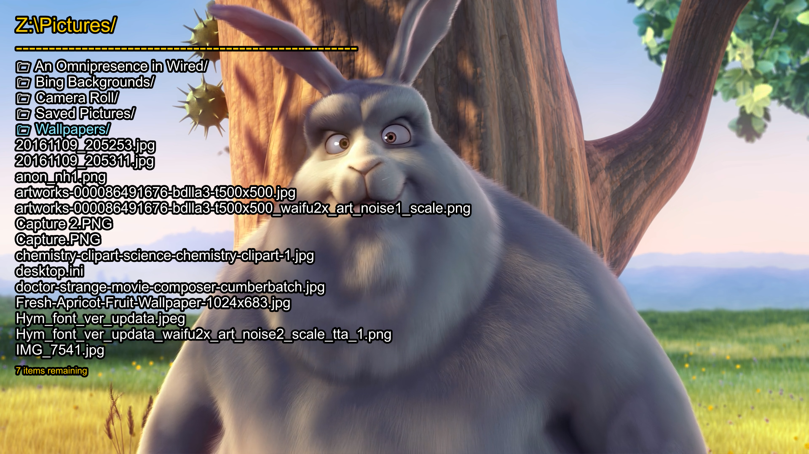

# mpv-file-browser

This script allows users to browse and open files and folders entirely from within mpv. The script uses nothing outside the mpv API, so should work identically on all platforms. The browser can move up and down directories, start playing files and folders, or add them to the queue.

## Keybinds
The following keybind is set by default

    MENU            toggles the browser

The following keybinds are only set while the browser is open:

    ESC             closes the browser or clears the selection
    ENTER           plays the currently selected file or folder
    Shift+ENTER     appends the current file or folder to the playlist
    DOWN            move selector down the list
    UP              move selector up the list
    RIGHT           enter the currently selected directory
    LEFT            move to the parent directory
    HOME            move to the directory of the currently playing file
    Shift+HOME      move to the root directory
    Ctrl+r          reload directory and reset cache
    Ctrl+ENTER      toggle selection for the current item
    Ctrl+RIGHT      select current item
    Ctrl+LEFT       deselect current item
    Ctrl+DOWN       drag selection down
    Ctrl+UP         drag selection up

## Root Directory
To accomodate for both windows and linux this script has its own virtual root directory where drives and file folders can be manually added. This can also be used to save favourite directories. The root directory can only contain folders.

The root directory is set using the `root` option, which is a semicolon separated list of directories. Entries are sent through mpv's `expand-path` command. By default the only root value is the user's home folder:

`root=~/`

It is highly recommended that this be customised for the computer being used; [file_browser.conf](file_browser.conf) contains commented out suggestions for generic linux and windows systems. For example, my windows root looks like:

`root=~/;C:/;D:/;E:/;Z:/`

## Multi-Select
By default file-browser only opens/appends the single item that the cursor has selected. However, using the `Ctrl` keybinds specified above, it is possible to select multiple items to open all at once. Selected items are shown in a different colour to the cursor. When multiple items are selected, they will be appended after the currently selected file when using the ENTER commands. The currently selected (with the cursor) file will always be added first, regardless of if it is part of the multi-selection, and will follow replace/append behaviour as normal. Selected items will be appended to the playlist afterwards in the order that they appear on the screen.

## Configuration
Currently there aren't many options worth changing other than `root`. See [file_browser.conf](file_browser.conf) for the full list and their default values.
